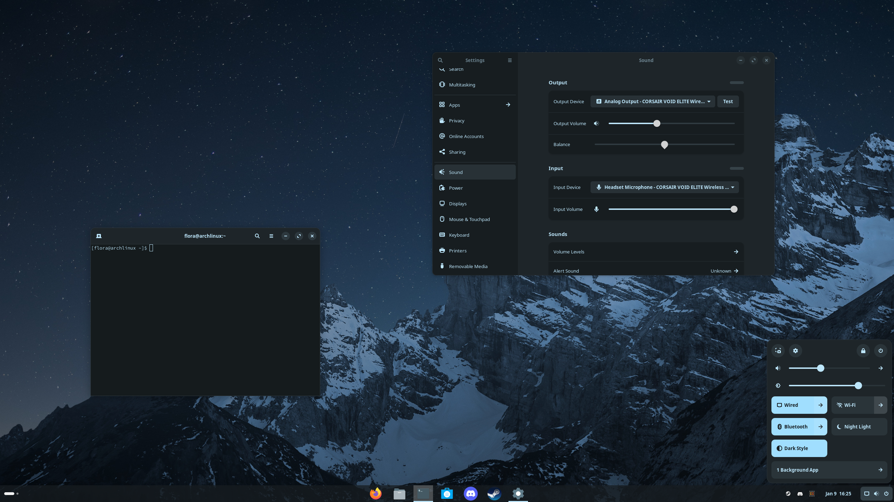

# ZorinOS gnome-shell theme 45

This is Zorin OS 17 gnome-shell theme ported to gnome 45. 
also included gtk3 and gtk4 CSS (gradience generated and edited).

Not perfect but good enough for me.

Original credits go to ZorinOs Team. 

https://github.com/ZorinOS/zorin-desktop-themes